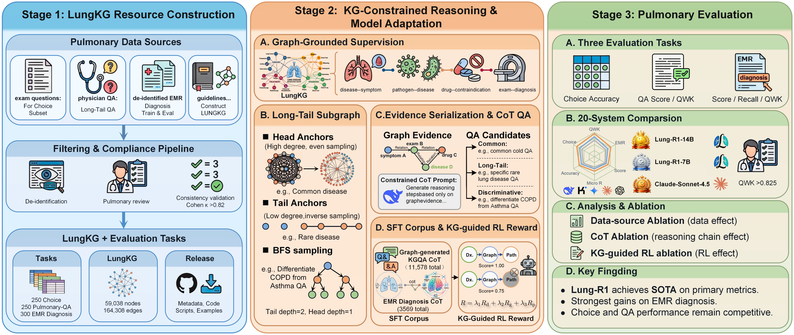

# Lung-R1: A Knowledge Graph-Guided LLM for Pulmonary Diagnostic Reasoning

[](LICENSE)
[](https://www.python.org/downloads/)
[](https://modelscope.cn/)
[]()

**Lung-R1** is a research framework that enhances large language models for pulmonary disease diagnosis by combining **knowledge graph-guided chain-of-thought reasoning** with **GRPO (Group Relative Policy Optimization) reinforcement learning**.



## News

- **[2026/06]** — Initial open-source release: LungKG, Graph-CoT, GRPO training code, and LungBench.

## Highlights

- **Unified Pulmonary KG** — Fuses a structured medical knowledge graph with clinical guideline extractions into LungKG (59K entities, 164K relations across 15 types).
- **Long-Tail Graph-CoT** — Inverse-degree weighted subgraph sampling prioritizes rare entities, generating high-quality multi-hop reasoning QA pairs.
- **KG-Guided GRPO** — Three-component reward function: diagnosis correctness + graph faithfulness + relation consistency, ensuring the model grounds its reasoning in structured knowledge.
- **Full Pipeline** — From KG construction → CoT QA generation → SFT → GRPO → Benchmark evaluation, all in one repository.
- **NPU-Native Training** — Built for Ascend NPU with DeepSpeed ZeRO-3. Qwen2.5 7B/14B supported.

## Table of Contents

- [Quick Start](#quick-start)
- [Pipeline](#pipeline)
- [Method](#method)
  - [Graph-CoT: Long-Tail KG QA Generation](#graph-cot-long-tail-kg-qa-generation)
  - [GRPO with KG Reward](#grpo-with-kg-reward)
- [Repository Structure](#repository-structure)
- [LungBench Benchmark](#lungbench-benchmark)
- [Model Weights](#model-weights)
- [Citation](#citation)
- [License](#license)
- [Acknowledgement](#acknowledgement)

## Quick Start

### Requirements

- Python 3.10+
- Ascend NPU + CANN (for GRPO training)
- DeepSpeed ZeRO-3 (optional, multi-NPU)

```bash
# Clone repository
git clone <repo-url>
cd lung-R1

# Install core dependencies
pip install -r requirements.txt

# For GRPO training
cd grpo && pip install -r requirements.txt

# Setup KG data symlinks for GRPO
# After running the LungKG fusion pipeline, create symlinks so GRPO can find the KG:
mkdir -p grpo/kg_data
ln -s ../../LungKG/LungKG_fusion/output/nodes.csv grpo/kg_data/nodes.csv
ln -s ../../LungKG/LungKG_fusion/output/edges.csv grpo/kg_data/edges.csv
```

### Generate KG-based QA Data

```bash
cd graphcot
python main.py \
  --kg_dir ../LungKG/LungKG_fusion/output \
  --output_dir output \
  --max_communities 8000 \
  --num_questions 4 \
  --tail_ratio 0.75 \
  --api_key "your-api-key"
```

### Train with GRPO

```bash
cd grpo

# Quick test (Qwen2.5-0.5B, 8 samples)
bash run_npu.sh --test

# Full training (Qwen2.5-7B / 14B)
bash run_npu.sh --7b
bash run_npu.sh --14b
```

### Evaluate on LungBench

```bash
cd evaluation/choice_eval
python benchmark_eval.py
```

## Pipeline

```
Medical KG ──┐
             ├──▶ LungKG ──▶ Graph-CoT ──▶ SFT ──▶ GRPO ──▶ LungBench
Guidelines ──┘                                       (KG Reward)
```

1. **LungKG** — Fuse self-constructed medical knowledge with clinical guideline extractions via a 6-step alignment + deduplication pipeline.
2. **Graph-CoT** — Sample long-tail subgraphs from LungKG, generate multi-hop reasoning QA pairs with verifiable evidence chains.
3. **SFT** — Supervised fine-tuning on EMR diagnosis + KG QA data using LLaMA-Factory with curriculum learning (KG QA → EMR).
4. **GRPO** — Reinforcement learning guided by a three-component KG reward function that optimizes diagnostic reasoning.
5. **LungBench** — Self-designed pulmonary benchmark with 250 questions, EMR diagnosis evaluation, and KGQA tests across 10+ models.

## Method

### Graph-CoT: Long-Tail KG QA Generation

Knowledge graphs are inherently long-tail distributed — a few entities (e.g., "pneumonia") appear in many triples while most appear in only a few. Standard random sampling underserves rare entities, producing QA pairs that miss critical but uncommon medical knowledge.

**Algorithm:**

1. **Long-Tail Partitioning** — Assign a sampling weight to each entity inversely proportional to its degree. Higher-degree entities get lower weights, ensuring rare diseases, symptoms, and treatments are prioritized.
2. **BFS Subgraph Expansion** — For each sampled seed entity, expand via breadth-first search to extract a local subgraph as the reasoning context.
3. **Multi-Hop CoT Generation** — Prompt the LLM to generate questions and answers that require multi-hop reasoning across the subgraph, producing structured outputs with `evidence`, `thought`, and `answer` fields.

### GRPO with KG Reward

Standard GRPO optimizes policy based on task correctness alone. Lung-R1 introduces a **KG-aware reward function** that jointly optimizes diagnostic accuracy and knowledge faithfulness:

$$R = \lambda_1 \cdot R_{\text{dx}} + \lambda_2 \cdot R_{\text{graph}} + \lambda_3 \cdot R_{\text{path}}$$

| Component | Weight | What it Measures |
|-----------|--------|-------------------|
| $R_{\text{dx}}$ — Diagnosis Correctness | 0.50 | F1 score on disease mentions + KG proximity bonus + string overlap with ground truth |
| $R_{\text{graph}}$ — Graph Faithfulness | 0.25 | Whether entity pairs mentioned in model output are connected in LungKG |
| $R_{\text{path}}$ — Path Consistency | 0.25 | Whether the reasoning path (entity→relation→entity) respects valid KG relation types |

This design penalizes *hallucinated* diagnoses (correct-sounding but not grounded in the KG) while rewarding outputs that faithfully trace through verified medical knowledge.

## Repository Structure

```
lung-R1/
├── README.md                       # This file
├── PROJECT_GUIDE.md                # Detailed project guide
├── requirements.txt
├── LungKG/                         # Knowledge graph construction
│   ├── LungKG_fusion/              #   KG fusion pipeline (6-step alignment + dedup)
│   ├── LungKGpart1/                #   Medical KG extraction
│   └── nano-graphrag/              #   Guideline entity/relation extraction
├── graphcot/                       # Long-tail KG CoT QA generation
├── SFT/                            # SFT training data & LLaMA-Factory configs
│   ├── with_cot/                   #   SFT data directory (available upon request)
│   ├── without_cot/                #   SFT data directory (available upon request)
│   └── configs/                    #   Curriculum learning env configs
├── grpo/                           # GRPO reinforcement learning (NPU)
│   ├── grpo_train.py               #   Training entry point
│   ├── kg_reward.py                #   3-component KG reward function
│   ├── run_npu.sh                  #   NPU launch script
│   └── data/                        #   Training data (available upon request)
└── evaluation/                     # Pulmonary benchmark & evaluation
    ├── choice_eval/                #   250-question benchmark + model scores
    ├── emr_eval/                   #   EMR diagnosis evaluation
    └── kgqa_eval/                  #   KGQA evaluation
```

## LungBench Benchmark

We design LungBench, a self-constructed pulmonary diagnosis evaluation benchmark:

| Evaluation | Content | Metric |
|-----------|---------|--------|
| `choice_eval` | 250 multiple-choice questions (single + multi-select) covering respiratory diseases, symptoms, examinations, and treatments | Accuracy (LLM-judged) |
| `emr_eval` | Electronic medical record diagnosis — real clinical case descriptions → diagnosis prediction | F1, Exact Match |
| `kgqa_eval` | Knowledge-grounded QA — questions requiring KG-based reasoning | Accuracy, Faithfulness |

## Model Weights

Trained model weights will be released on ModelScope upon publication.

<!--
| Model | Stage | ModelScope |
|-------|-------|-------------|
| Lung-R1-7B | SFT → GRPO (RL) | Link |
| Lung-R1-14B | SFT → GRPO (RL) | Link |
| Lung-R1-SFT | SFT only (7B/14B) | Link |
-->

## License

This project is licensed under the MIT License — see [LICENSE](LICENSE) for details.

## Acknowledgement

Lung-R1 builds on several excellent open-source projects:

- [LLaMA-Factory](https://github.com/hiyouga/LLaMA-Factory) — SFT training framework
- [nano-graphrag](https://github.com/gusye1234/nano-graphrag) — Guideline graph extraction
- [Qwen2.5](https://github.com/QwenLM/Qwen2.5) — Base language models
- [NetworkX](https://networkx.org/) — Graph algorithms
